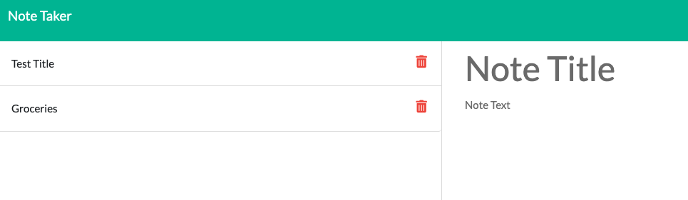
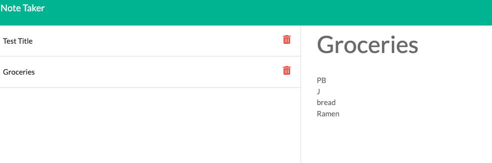

# Note Taker
 

 

## [Click here to visit the deployed page on Heroku.](https://note-taker-01152022-lc.herokuapp.com/)

  ## Licensing:
  
  ## Table of Contents: 
  - [Description](#description)
  - [Technology](#technology)
  - [Installation](#installation)
  - [Usage](#usage)
  - [Questions](#questions)

  ## Description:
  This application stores titled notes and is hosted on an external server using heroku.   
  ## Technology:
  This is a nodeJS app written using the Express framework and deployed using Heroku.
  ## Installation: 
  App is deployed on the web.  No special installation is required.  
  ## Usage: 
  Given a title field, the user can input the name of the note.  Then the user can enter the text which will populate the body of the note and hit the save icon to store it. All notes will appear on the left.  If the user would like to delete a note, they can do so by clicking the trash can delete icon to the right of the stored note title they wish to delete.  
  ## License: 
  None Provided 
  ## Questions: 
  lmc@uga.edu
  
  <https://github.com/tripledawg>